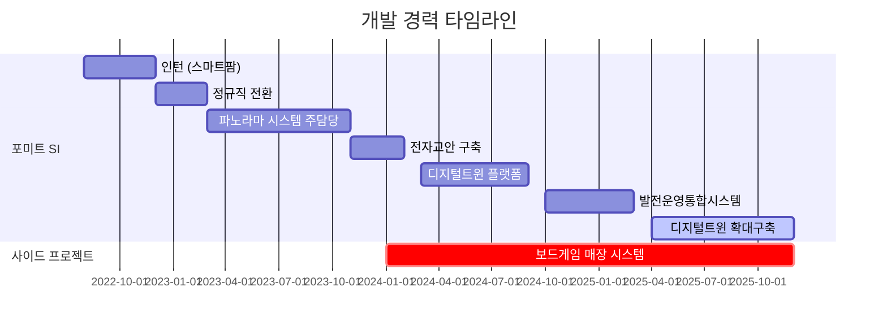

<div align="center">
  
&descAlignY=60)

### 👋 안녕하세요, 성장하는 백엔드 개발자 이현석입니다

**3.5년차 Backend Developer | SI 프로젝트 전문 | 공기업 시스템 개발 경험**

[](mailto:tjr9270@naver.com)
[](https://github.com/hyeonseok2da)
[](https://github.com/hyeonseok2da)

</div>

---

## 💼 About Me

```typescript
const developer = {
  name: "이현석 (Lee Hyeonseok)",
  role: "Backend Developer",
  company: "포미트 (SI)",
  experience: "3.5 years",
  location: "Busan, South Korea",
  
  expertise: {
    domain: ["디지털트윈", "발전운영통합시스템", "공기업 SI"],
    projects: ["한국수자원공사", "한국서부발전", "한국수력원자력", "한국중부발전"],
    achievement: "인턴 시작 3년 만에 핵심 프로젝트 주 담당자로 성장"
  },
  
  currentFocus: ["Spring Framework", "SSO 통합인증", "서버 최적화", "Next.js"],
  funFact: "내부망 환경에서도 최신 기술 트렌드를 놓치지 않기 위해 사이드 프로젝트 진행 중"
};
```

---

## 🛠 Tech Stack

### Backend


### Frontend


### Database


### DevOps & Tools


---

## 📈 Career Timeline



---

## 🚀 Major Projects

### 🏢 공기업 SI 프로젝트 (5개 이상)

<details>
<summary><b>📍 한국수자원공사 - 디지털트윈 확대구축 (2025.04 ~ 2025.12)</b></summary>

#### 역할
- 컨소시엄 프로젝트 단독 개발 및 전체 프로세스 주도
- 타 협력사와의 기술 협의 및 연계 시스템 개발

#### 주요 성과
- SSO 통합 인증 체계 구축
- 파노라마 이미지 자동 리사이징으로 성능 최적화
- Nginx 리버스 프록시 구성으로 정적 파일 서빙 성능 개선
- Tomcat WAS 메모리 튜닝

#### Tech Stack
`Spring Framework` `Oracle` `Tomcat` `Nginx` `SSO`

</details>

<details>
<summary><b>📍 한국서부발전 - 지능형 발전운영통합시스템 (2024.10 ~ 2025.03)</b></summary>

#### 역할
- 발전소 실시간 모니터링 시스템 백엔드 개발
- 공기업 보안 정책 준수 인증 체계 구축

#### 주요 성과
- SSO 통합 인증 및 세션 관리 구현
- 권한별 접근 제어 시스템 개발
- Tomcat WAS 메모리 튜닝 및 최적화

#### Tech Stack
`Spring Framework` `Oracle` `Tomcat` `SSO`

</details>

<details>
<summary><b>📍 한국수력원자력 - 파노라마 시스템 (2023.03 ~ 2023.11)</b></summary>

#### 역할
- 회사 주력 아이템의 첫 공기업 납품 프로젝트 담당
- 이후 파노라마 시스템 주 담당자로 성장

#### 주요 성과
- 360도 파노라마 뷰어 기반 원격 모니터링 시스템 개발
- 이미지 라이브러리 활용한 자동 리사이징으로 최적화
- 파노라마 CMS 백엔드 개발

#### Tech Stack
`Spring Framework` `Oracle` `JSP` `Tomcat`

</details>

### 💡 Side Projects

<details>
<summary><b>🎲 보드게임 매장 관리 통합 시스템 (2024 ~ 현재)</b></summary>

#### 프로젝트 개요
보드게임 제작 회사를 위한 재고관리 ERP + 매장별 게임 정보 시스템

#### 주요 기능
- 재고 관리 및 실시간 동기화
- 매장별 게임 정보 관리
- 사용자 즐겨찾기, 좋아요 기능
- 커스텀 차트를 통한 데이터 시각화
- Mobile-first 반응형 디자인

#### 성과
- ✅ 2025년 크리스마스 실제 서비스 오픈
- ✅ 실사용자 피드백 기반 지속 개선 중
- ✅ 기술이전 진행 중

#### Tech Stack
**Frontend:** `React 18` `Next.js 13+` `Tailwind CSS` `JavaScript ES6+`  
**Backend:** `Supabase` `PostgreSQL` `RESTful API`  
**State Management:** `React Hooks` `localStorage` `sessionStorage`  
**DevOps:** `Vercel` `CI/CD`

#### 배운 점
- 최신 기술 스택을 활용한 실제 서비스 개발 경험
- 사용자 피드백을 반영한 지속적인 개선 프로세스
- BaaS(Backend as a Service) 활용한 빠른 개발

</details>

---

## 📊 GitHub Stats

<div align="center">


</div>

---

## 🎯 Core Competencies

### 💻 기술적 역량
- **Backend Development**: Spring Framework 기반 엔터프라이즈 애플리케이션 개발
- **Security**: SSO 통합 인증, 보안 처리, 접근 제어 시스템 구현
- **Performance**: Tomcat 메모리 튜닝, Nginx 리버스 프록시 최적화
- **Database**: Oracle, PostgreSQL, MySQL 설계 및 최적화
- **Server Management**: WAS/WEB 서버 구축 및 배포

### 🏗️ 프로젝트 경험
- **대규모 SI 프로젝트**: 5개 이상의 공기업 프로젝트 수행
- **독립 수행 능력**: 컨소시엄 환경에서 단독 개발 및 프로젝트 관리
- **기술 협의**: 타 협력사와의 연계 시스템 개발 조율
- **Full-cycle**: 개발부터 출장, 산출물 작성까지 전 과정 주도

### 🌱 학습 및 성장
- **빠른 성장**: 인턴 시작 3년 만에 핵심 프로젝트 주 담당자
- **트렌드 학습**: 내부망 환경에서도 최신 기술 스택 사이드 프로젝트로 학습
- **실전 경험**: 실제 서비스 개발 및 운영 경험
- **지식 공유**: 3년간 Python 오픈채팅방 운영 및 멘토링

---

## 🎓 Education & Community

**🏫 동의대학교 소프트웨어공학과** (2017.03 ~ 2023.02)
- 4학년 1학기까지 전 학점 이수 후 조기 취업

**👥 Python 오픈채팅방 운영** (3년간)
- 대학생 대상 Python 학습 지원 및 과제 해결
- 실무 경험 기반 기술 상담 및 커리어 조언

**📜 자격증**
- 정보처리기사 취득 예정

---

## 💬 Let's Connect!

<div align="center">

[](mailto:tjr9270@naver.com)
[](https://github.com/hyeonseok2da)

**"끊임없이 배우고 성장하는 개발자가 되겠습니다"**

</div>

---

<div align="center">


[](https://github.com/hyeonseok2da)

</div>
